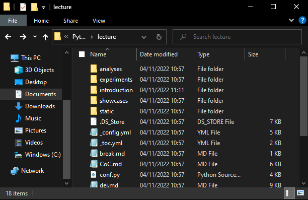
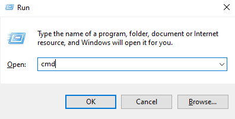

# Tips for Windows

To make sure that our lovely Windows users can also use bash, we ask you to install **Windows System for Linux (WSL)**. This is not necessary for Mac or Linux users, as their terminals already use bash. Here are some notes and tips we've put together for Windows users working with WSL.

## What is WSL?

WSL does what the name suggests - it is a *subsystem*. It emulates a Linux machine but runs *inside* of your Windows operating system. [Microsoft have a good introduction](https://learn.microsoft.com/en-us/windows/wsl/about) to WSL.

## Installing WSL

We've put installation instructions for `wsl` [in the setup instructions](setup.html#os-specific-installation-instructions).

### Accessing your Files on Windows

WSL has its own area for accessing and working with files. If you open the Ubuntu app, by default, this will open a bash terminal with the working directory set to your user's area. We go into detail on how you can navigate the areas with the bash terminal in the [Introduction II](introduction/intro_to_shell.html) section.

But what if you want to access files you have downloaded to your Windows system? For example, you might have a Python script in *Downloads*, or you might have downloaded the course materials to the location `C:\Users\HanSolo\Documents\Frankfurt\PFP2022\materials\lecture`. Well, WSL can access these files through `/mnt/c`. If you open an Ubuntu terminal and change your directory with the following, you will then be able to navigate through the contents of your C drive.

    cd /mnt/c/HanSolo/Documents/Frankfurt/PFP2022/materials/lecture

Note that whereas Windows uses backward slashes (`\`), the bash shell uses forward slashes (`/`), so these will all need replacing.

### *Quickly* Accessing your Files on Windows

If you would like a faster way to access your files in Ubuntu, without manually replacing all the backward slashes, here is one option.

1. In Windows, open the folder containing the files you'd like to work with in Ubuntu

2. Open a command prompt terminal, by pressing `Win` + `R`, typing `cmd`, and clicking *Ok*.

3. Change the command prompt working directory to the folder you want to work with. You can copy and paste the Windows path from the folder's window.

    cd C:\Users\HanSolo\Documents\Frankfurt\PFP2022\materials\lecture

4. Type `wsl` to open WSL, and the working directory will automatically be set to the folder you want to work with!

    wsl
